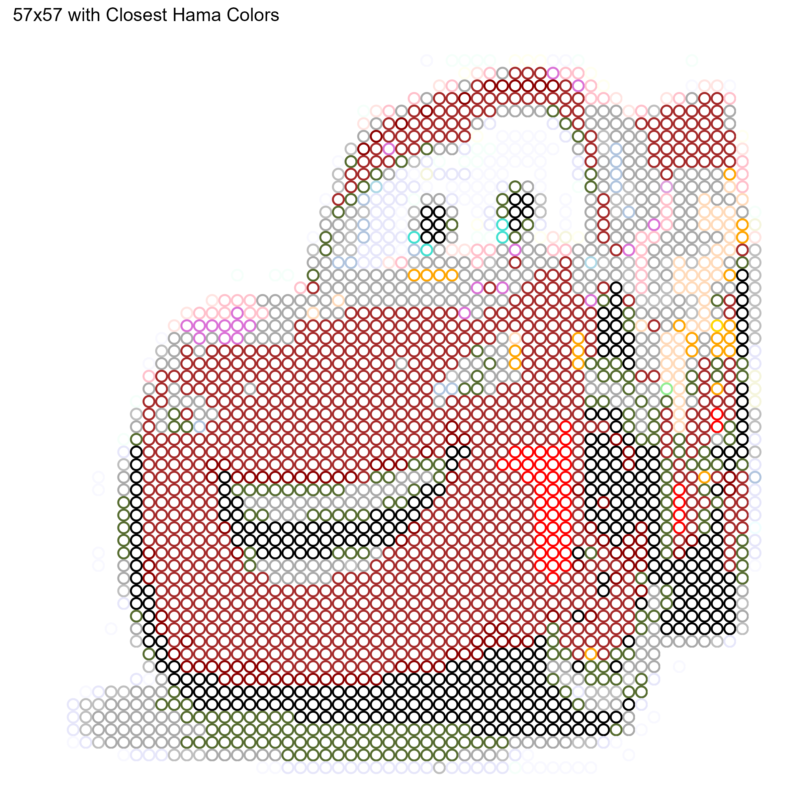

# Image to Hama Beads Pattern

Shiny app for converting images to Hama Beads Pattern
 
**Link**: [https://eea1.shinyapps.io/Image_to_Hama_Beads/](https://eea1.shinyapps.io/Image_to_Hama_Beads/)

### Example Input
 
  

### Example Output 29x29

  

### Example Output 57x57

